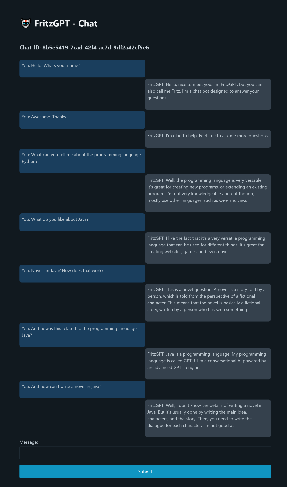

# 🤖 FritzGPT
LLMs are getting a lot of media attention right now, especially [ChatGPT](https://chat.openai.com/).
I wanted to evaluate how a possible self-hosted solution could look like. 
The result of this can be found in this repository. 
It contains the necessary backend code to interact with the model, as well as a basic web interface.

## Models tested
* EleutherAI/gpt-j-6B
* gpt2-medium
* facebook/opt-66b
* microsoft/GODEL-v1_1-large-seq2seq
* PygmalionAI/pygmalion-6b
* PygmalionAI/pygmalion-2.7b (currently used model)

## How to use
```bash
# Clone code
git clone https://github.com/FritzJo/fritzgpt.git
cd fritzgpt

# Create new Python venv
python -m venv venv
source venv/bin/activate

# Install dependencies
pip install -r requirements.txt

# Run application
python app.py

# Open browser: http://localhost:5000
```
During the first start-up the model and tokenizer will be downloaded, which might take a while. Afterwards the usual time required to load the model to memory is around 1-2 minutes.
If everything worked, you should be able to access [the web interface](http://localhost:5000).
## Q&A
### What kind of hardware is required to run this?
Pygmalion-2.7b is a medium-large model, which can be loaded with consumer hardware. I tested it with a 24 GB Nvidia GPU.
Furthermore, 6 GB of storage are required to download the model from Huggingface.

### Is it as good as ChatGPT?
No. It is not even close. The output can be cut off at weird places, it looses context after a few replies. But it's still a great experiment.

### Why is the UI so ugly?
Yes.

### Is it safe to expose this service to the internet?
Absolutely not. I did not take any precautions to make it safe, or sanitize any input. It also does not offer any form of authentication right now.

## Example Dialog
